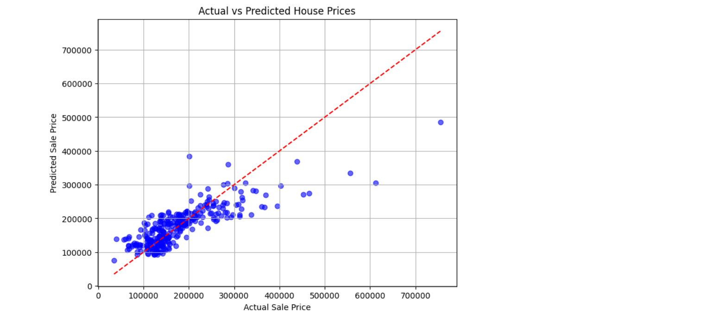

# PRODIGY_ML_01 - House Price Prediction using Linear Regression

This project implements a linear regression model to predict house prices based on:
- Square footage (`GrLivArea`)
- Number of bedrooms (`BedroomAbvGr`)
- Number of full bathrooms (`FullBath`)

## 📊 Dataset
The dataset used is from Kaggle's [House Prices - Advanced Regression Techniques](https://www.kaggle.com/c/house-prices-advanced-regression-techniques/data)

## 📈 Output
 <!-- Replace with your actual plot screenshot filename -->

## 📁 Folder Structure
